# Image Classification Using Deep Learning


<span class="badge-buymeacoffee">
<a href="https://ko-fi.com/mayurjain" title="Buy Me A Coffee"></a>
</span>
<span class="badge-patreon">
<a href="https://patreon.com/startingBrain" title="Donate to this project using Patreon"></a>
</span>


**Learning and Building Image Classification Models using PyTorch. Models, selected are based on number of citation of the paper with the help of [paperwithcode](https://paperswithcode.com/) along with unique idea deviating from typical architecture like using transformers for CNN.**

<!-- 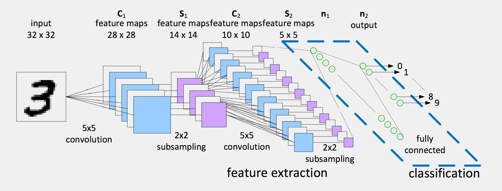 -->

Image Classification is a fundamental computer vision task with huge scope in various applications like self driving cars, medical imaging, video frame prediction etc. Each model is either a new idea or built upon exisiting idea. We'll capture each of these idea and experiment and benchmark on predefined criteria.

### [Try Out In Google Colab](https://colab.research.google.com/drive/1tVjUG0dn4D0XqTSsCZ6AKom7G_hg0Xnv?usp=sharing)

### 🗒 Papers With Implementation

Base Config: **{ epochs: 10, lr: 0.001, batch_size: 128, img_resolution: 224, optim: adam }**. 

Some architecture like SqueezeNet, ShuffleNet, InceptionV3, EfficientNet, Darknet53 and others didn't work at base config because of increased complexity of the architecture, thus by reducing the batch size the architecture was executed in Google Colab and Kaggle.

Optimizer script: Includes the approx setup of the optimizer used in the original paper. Few setup led to Nan loss and were tweaked to make it work.

I've noticed that Google Colab has 12GB GPU while Kaggle has 16 GB GPU. So in worst case scenario, I've reduced the batch size in accordance to fit the Kaggle GPU. Just to mention, I use RTX2070 8GB.

|CNN Based    | Accuracy | Parameters     | FLOPS | Configuration | LR-Scheduler(Accuracy) |
| :---        | :----:       | :----:       | :----:       | :----:       | :---:       |
| [AlexNet](https://papers.nips.cc/paper/2012/hash/c399862d3b9d6b76c8436e924a68c45b-Abstract.html")| 71.27 | 58.32M | 1.13GFlops | - | CyclicLR(79.56) |
| [VGGNet](https://arxiv.org/abs/1409.1556)   | 75.93 | 128.81M | 7.63GFlops| - | - |
| [Network In Network](https://arxiv.org/abs/1312.4400) | 71.03 | 2.02M | 0.833GFlops | - | - |
| [ResNet](https://arxiv.org/abs/1512.03385)  | 74.9 | 11.18M | 1.82GFlops | - | CyclicLR(74.9) |
| [DenseNet-Depth40](https://arxiv.org/abs/1608.06993)   | 68.25 | 0.18M | - | B_S = 8 | - |
| [MobileNetV1](https://arxiv.org/abs/1704.04861)   | 81.72 | 3.22M | 0.582GFlops | - | - |
| [MobileNetV2](https://arxiv.org/abs/1801.04381)   | 83.99 | 2.24M | 0.318GFlops | - | - |
| [GoogLeNet](https://arxiv.org/abs/1409.4842)   | 80.28 | 5.98M | 1.59GFlops | - | - |
| [InceptionV3](https://arxiv.org/abs/1512.00567)   | - | - | 209.45GFlops | H_C_R |
| [Darknet-53](https://arxiv.org/pdf/1804.02767.pdf)   | - | - | 7.14GFlops | H_C_R |
| [Xception](https://arxiv.org/abs/1610.02357)   | 85.9 | 20.83M | 4.63GFlops | B_S = 96 | - |
| [ResNeXt](https://arxiv.org/abs/1611.05431)   | - | | 69.41GFlops | H_C_R | |
| [SENet](https://arxiv.org/abs/1709.01507)   | 83.39 | 11.23M | 1.82GFlops | - | CyclicLR(78.10) |
| [SqueezeNet](https://arxiv.org/abs/1602.07360v4)   | 62.2 | 0.73M | 2.64GFlops | B_S = 64 |
| [ShuffleNet](https://arxiv.org/abs/1707.01083)   | | | 2.03GFlops | B_S = 32 | - |
| [EfficientNet-B0](https://arxiv.org/abs/1905.11946)   | - |4.02M| 0.4GFlops| | |
| [EfficientNetV2](https://arxiv.org/abs/2104.00298)| | 20.33M | - | - | WarmupLinearSchedule(74.6) |
| Transformer Based |
| [ViT](https://arxiv.org/abs/2010.11929)   | - | 53.59M | - | - | WarmupCosineSchedule(55.34) |
| MLP Based |
| [MLP-Mixer](https://arxiv.org/abs/2105.01601) | 68.52 | 13.63M | - | - | WarmupLinearSchedule(69.5) |
| [ResMLP](https://arxiv.org/abs/2105.03404)| 65.5 | 14.97M | - | - | - |
| [gMLP](https://arxiv.org/abs/2105.08050)| 71.69 | 2.97M | - | - | CyclicLR(66.4) |
| Other |
| [ResNet With SAM](https://arxiv.org/pdf/2010.01412v3.pdf) | 76.2 | 11.8M | - | - | CyclicLR(76.2) |

B_S - Batch Size

H_C_R - High Compute Required

**Note: Marked few cells as high compute required because even with batch_size = 8, the kaggle compute was not enough. The performance of the model especially with regards to accuracy is less because the model runs only for 10 epochs, with more epochs the model converges further. Learning rate scheduler is underestimated, try out various learning rate scheduler to get the maximum out of the network.**

### [Google Colab Notebook to tune hyperparameters with Weights and Biases Visualizations](https://colab.research.google.com/drive/1tIyEAbXcbRf4mKqXp2rqqQ6bOpTaPZKz?usp=sharing)

<!--##########################################################################################-->

### Create Environment
```python
python -m venv CNNs 
source CNNs/bin/activate 
git clone https://github.com/Mayurji/CNNs-PyTorch.git
```

### Installation
```python
pip install -r requirements.txt
```

### Run
```python
python main.py --model=resnet
```
### To Save Model
```python
python main.py --model=resnet --model_save=True
```
### To Create Checkpoint
```python
python main.py --model=resnet --checkpoint=True
```

**Note:** Parameters can be changed in YAML file. The module supports only two datasets, MNIST and CIFAR-10, but you can modify the dataset file and include any other datasets.

<!--##########################################################################################-->

### Plotting

By default, the plots between train & test accuracy, train & test loss is stored in plot folder for each model. 

| Model | Train vs Test Accuracy | Train vs Test Loss |
| :---:        | :----:       | :---:       |
| AlexNet | 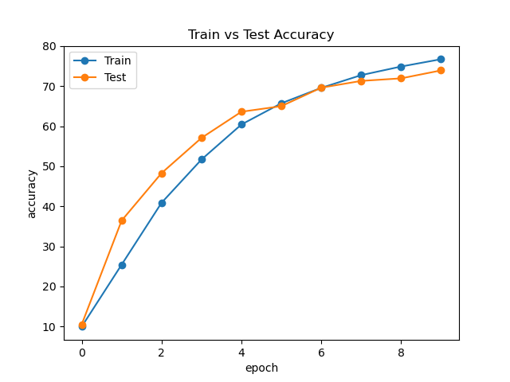 | 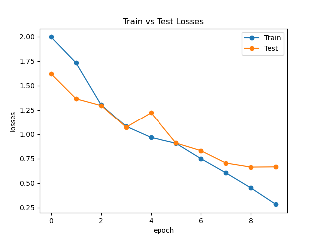 |
| ResNet |  | 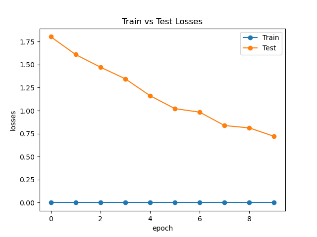 |
| ViT | 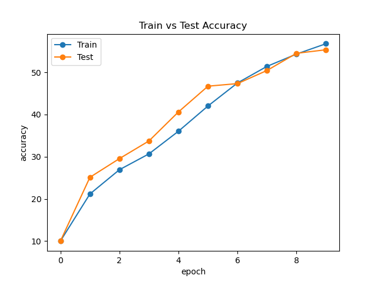 | 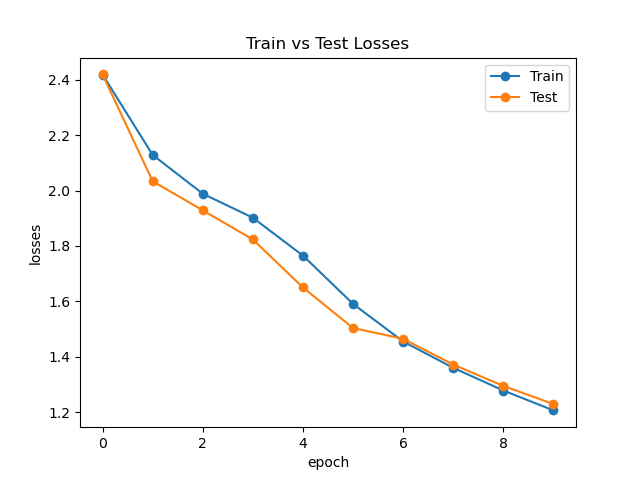 |
| MLP-Mixer | 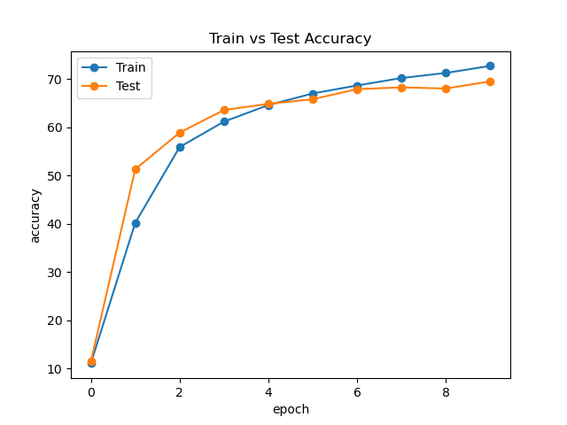 | 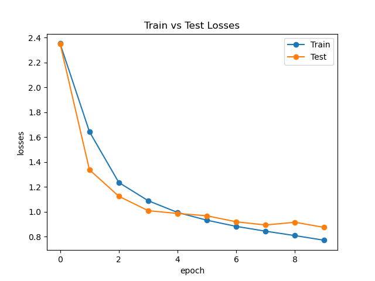 |
| ResMLP | 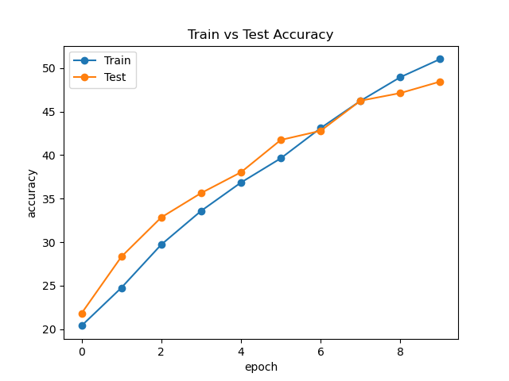 | 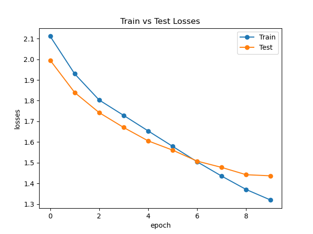 |
| SENet |  | 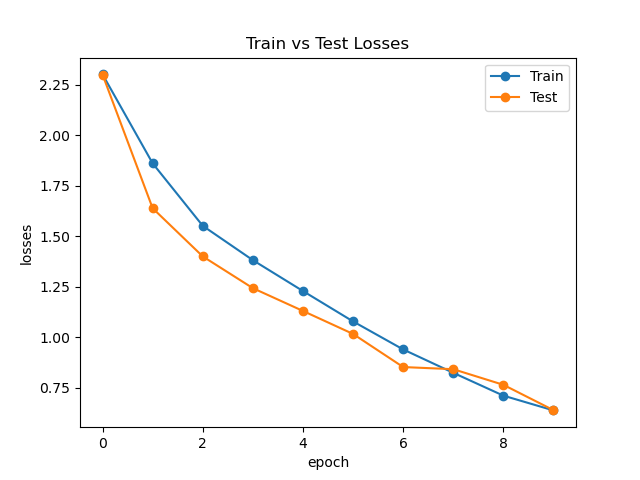 |
| gMLP | 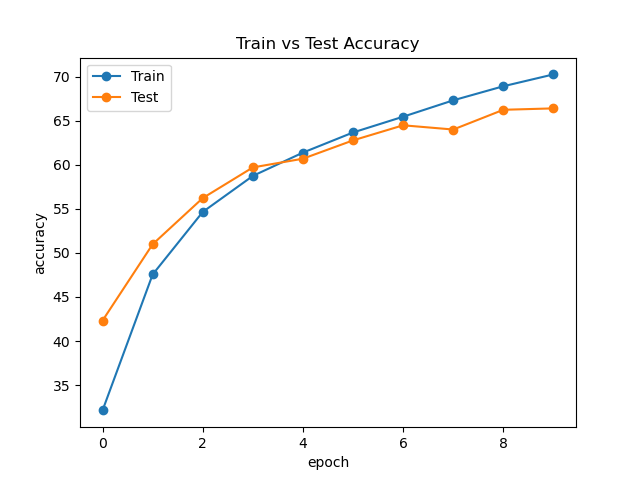 | 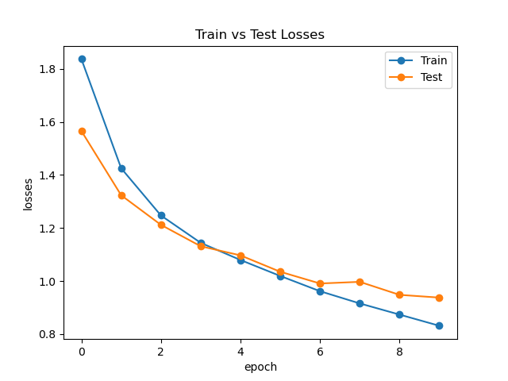 |
| EfficientNetV2 | 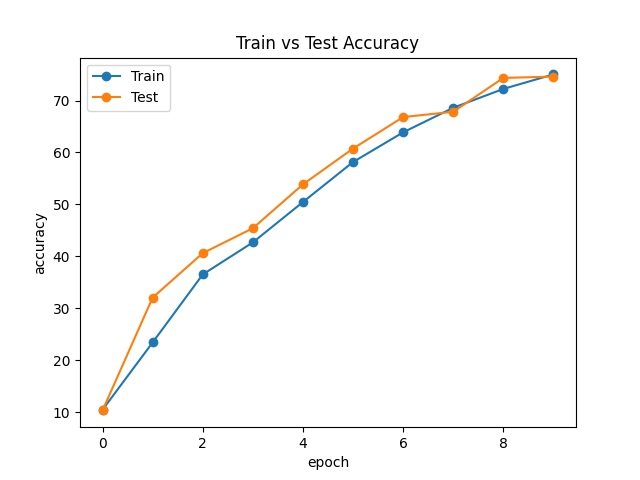 | 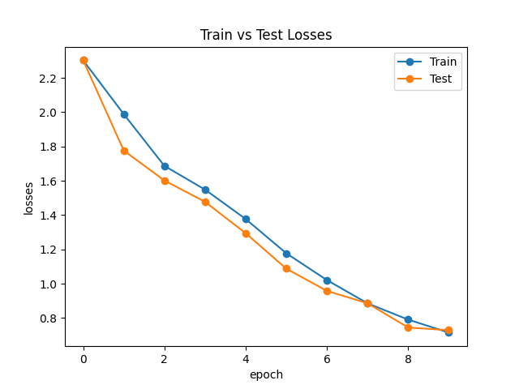 |
| ResNet18 With SAM | 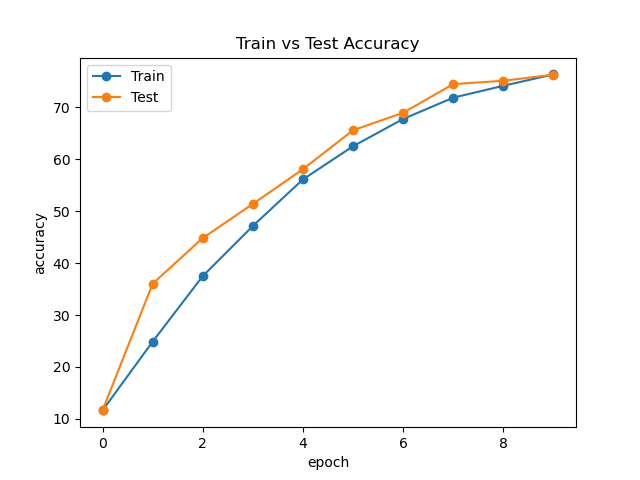 ||

<!--##########################################################################################-->

### Content

Find all the basic and necessary details about the different architecture below.

<details>
  <summary>🔥 AlexNet</summary>
<p>
  
    Before AlexNet, SIFT(scale-invariant feature transform), SURF or HOG were some of the hand tuned 
    feature extractors for Computer Vision.

    In AlexNet, Interestingly in the lowest layers of the network, the model learned feature extractors 
    that resembled some traditional filters. Higher layers in the network might build upon these 
    representations to represent larger structures, like eyes, noses, blades of grass, and so on. Even 
    higher layers might represent whole objects like people, airplanes, dogs, or frisbees. Ultimately, 
    the final hidden state learns a compact representation of the image that summarizes its contents such 
    that data belonging to different categories can be easily separated.
    
    Challenges perceived before AlexNet:

    Computational Power:

    Due to the limited memory in early GPUs, the original AlexNet used a dual data stream design, so that 
    each of their two GPUs could be responsible for storing and computing only its half of the model. 
    Fortunately, GPU memory is comparatively abundant now, so we rarely need to break up models across GPUs 
    these days.

    Data Availability:

    ImageNet was released during this period by researchers under Fei-Fei Li with 1 million images, 1000 images 
    per class with total of 1000 class.

    Note:
    Instead of using ImageNet, I am using MNIST and resizing the image to 224 x 224 dimension to make it justify 
    with the AlexNet architecture.
</p>
  
 
</details>

<details>
  <summary>🔥 VGGNet</summary>
  <p>
    
    VGGNet brings in the idea of buliding a block of network like a template unlike previous CNN architecture 
    where the network is built layer by layer with increasing complexity.
  
    VGG network helps researchers think in terms of block of network. A typical convolution would 
    require following steps
  
    * Conv with padding for maintaining resolution.
    * Activation Function
    * Pooling for spatial downsampling
  
    Note: I don't recommend running this until you have GPU, the number of parameters is increased by huge number 
    compared to AlexNet.

    Changes made for faster convergence and which deviates from VGG Net is learning rate is changed to 0.05 and 
    reduce the number channels by 1/4th.

    Check out the loss with these changes, since lr is high compared to typical values, the loss moves drastically 
    and then converges. Without Xavier's Weight Initialization, the model performs poorly.

    Why VGG is slower than AlexNet?

    One reason is that AlexNet uses (11x11 with a stride of 4), while VGG uses very small receptive fields (3x3 
    with a stride of 1) which makes it slower to move over the image and overall the parameters are 3 times the 
    AlexNet.
    
  </p>

</details>
<details>
  <summary>🔥 NIN</summary>
<p>
  
    Network In Network introduced one of the key concept in deep neural network of dimension downsampling/upsampling 
    using 1x1Conv layer. It applies MLP on the channels for each pixel separately.

    The idea behind NiN is to apply a fully-connected layer at each pixel location (for each height and width). 
    If we tie the weights across each spatial location, we could think of this as a 1×1 convolutional layer 
    or as a fully-connected layer acting independently on each pixel location. Another way to view this is to think
    of each element in the spatial dimension (height and width) as equivalent to an example and a channel as equivalent
    to a feature.

    NIN introduces the 1x1 Convolution. Smaller batch size results in better performance even though it is slow.
  
  </p>
  
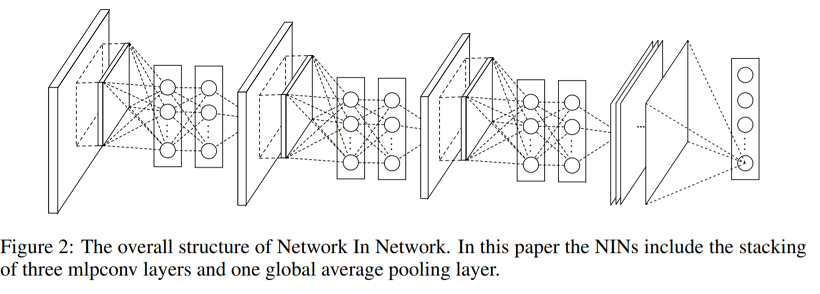
</details>
<details>
<summary>🔥 GoogLeNet</summary>
<p>
  
    It combined ideas from NIN and VGG network introducing InceptionV1 also known as GoogLeNet. 

    In AlexNet, we've used 11x11 Conv, in NIN, we used 1x1 Conv. And in this paper, we identify
    among different kernel, which sized convolutional kernels are best. It is the version 1 of Inception
    model. 

    GoogLeNet introduces the concept of parallel concatenation of networks. We bulid Inception block and 
    which is repeated in the architecture.

    Some intution on the architecture, since the various different sized filters are at work, different spatial
    relations are extracted by different filters efficiently. It also allocates different amt of parameters
    across different filters.

    * 1×1 convolutions reduce channel dimensionality on a per-pixel level. Maximum pooling reduces the resolution.
    * If you're wondering how these dimensions were decided, it is based on trial and error & based on ImageNet 
    Dataset.
</p>
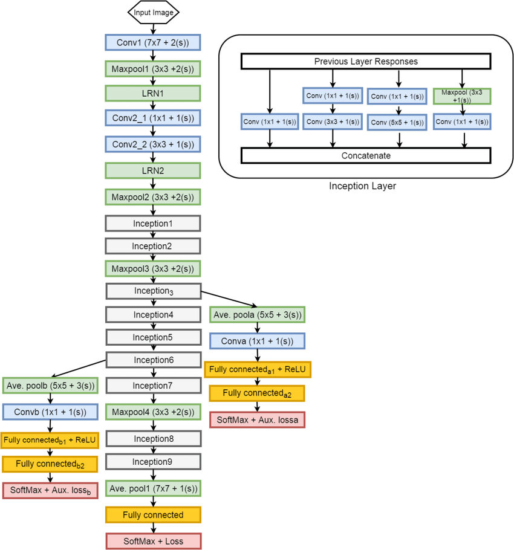
</details>
<details>
<summary>🔥 BatchNorm + ConvNet</summary>
<p>
    BatchNorm was introduced as a concept to **normalize the mini-batches traversing through the layer** and had an 
    impactful results having **regularization** effect. But why BatchNorm is effective is quite unclear? the author 
    suggests that BatchNorm reduce internal variant shift but other researchers  pointed out that the effects which 
    batchNorm is effective against is not related to covariant shift. It is still widely discussed topic in DL.
  
</p>

</details>
<details>
<summary>🔥 ResNet</summary>
<p>
  
    ResNet Architecture has huge influence in current DNN architectures. It introduces the idea of **skip connection**, 
    a concept of **adding** an unfiltered input to the conv layers.

    Why ResNet?

    To understand the network as we add more layers, does it becomes more expressive of the
    task in hand or otherwise.

    Key idea of ResNet is adding more layers which acts as a Identity function, i.e. if our
    underlying mapping function which the network is trying to learn is F(x) = x, then instead
    of trying to learn F(x) with Conv layers between them, we can directly add an skip connection
    to tend the weight and biases of F(x) to zero. This is part of the explanation from D2L.
    Adding new layer led to ResNet Block in the ResNet Architecture.

    In ResNet block, in addition to typical Conv layers the authors introduce a parallel identity 
    mapping skipping the conv layers to directly connect the input with output of conv layers.
    A such connection is termed as Skip Connection or Residual connection.

    Things to note while adding the skip connection to output conv block is the dimensions.Important
    to note, as mentioned earlier in NIN network, we can use 1x1 Conv to increase and decrease the 
    dimension.

    In the code block, we have built ResNet18 architecture:

    There are 4 convolutional layers in each module (excluding the 1×1 convolutional layer). 
    Together with the first 7×7 convolutional layer and the final fully-connected layer, there are 
    18 layers in total. Therefore, this model is commonly known as ResNet-18.
</p>

</details>
<details>
<summary>🔥 DenseNet</summary>
  <p>
    
    Building upon ResNet, DenseNet introduced the idea of **concatenating** the previous layers 
    output and as well the inputs to the next layers.

    In ResNet, we see how the skip connection added as identity function from the inputs
    to interact with the Conv layers. But in DenseNet, we see instead of adding skip 
    connection to Conv layers, we can append or concat the output of identity function
    with output of Conv layers.

    In ResNet, it is little tedious to make the dimensions to match for adding the skip
    connection and Conv Layers, but it is much simpler in DenseNet, as we concat the 
    both the X and Conv's output.

    The key idea or the reason its called DenseNet is because the next layers not only get
    the input from previous layer but also preceeding layers before the previous layer. So 
    the next layer becomes dense as it loaded with output from previous layers.

    Check Figure 7.7.2 from https://d2l.ai/chapter_convolutional-modern/densenet.html for 
    why DenseNet is Dense?

    Two blocks comprise DenseNet, one is DenseBlock for concat operation and other is 
    transition layer for controlling channels meaning dimensions (recall 1x1 Conv).
  </p>
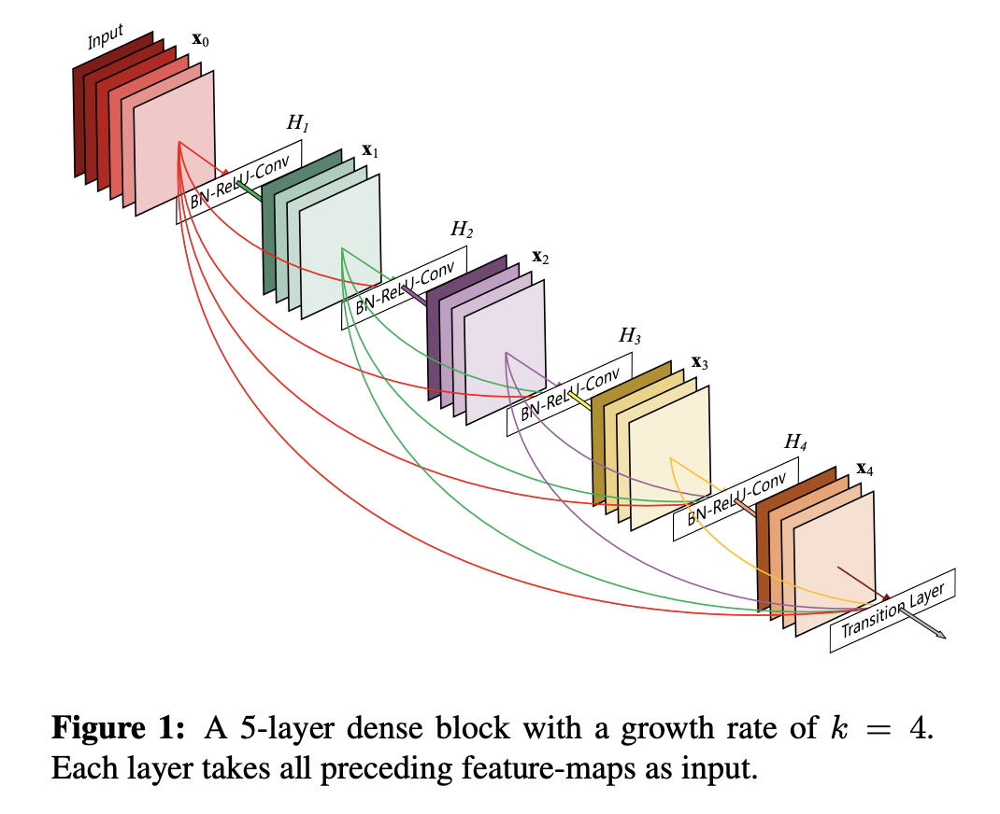
</details>
<details>
<summary>🔥 Squeeze And Excitation Network</summary>
<p>
  
    A typical convolution network has kernels running through image channels and combining
    the feature maps generated per channel. For each channel, we'll have separate kernel which
    learns the weights through backpropagation.

    The idea is to understand the interdependencies between channels of the images by explicitly
    modeling on it and hence to make the network sensitive to informative features which is further
    exploited in the next set of transformation.

      * Squeeze(Global Information Embedding) operation converts feature maps into single value per channel.
      * Excitation(Adaptive Recalibration) operation converts this single value into per-channel weight.

    Squeeze turns (C x H x W) into (C x 1 x 1) using Global Average Pooling.

    Excitation turns (C x 1 x 1) into (C x H x W) channel weights using 2 FC layer with activation function
    inbetween, then which is expanded as same size as input.

    Rescale the output from excitation operation into feature maps as earlier.

    Based on the depth of the network, the role played by SE operation is differs. At early layers,
    it excites shared low level representation irrespective of the classes. But in later stage, SE 
    network responds differently based input class.
    
    SE Block is simple and is added with existing CNN architecture to enhance the performance like 
    ResNet or Inception V1 etc.

      Reference: https://amaarora.github.io/2020/07/24/SeNet.html
</p>
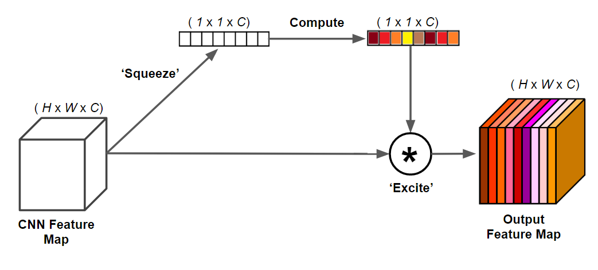
</details>
<details>
<summary>🔥 MLP-Mixer</summary>
  <p>
    
    This particular network doesn't come under convolutional networks as the key idea is to use simple MLP 
    architecture.

    MLP-Mixer is a multi-layer perceptron based model, it uses common techniques like non-linearites, matrix 
    multiplication, normalization, skip connections etc. This paper is very interesting to the fact that when 
    MLP was introduced, it was particular made upfront that the MLP architectures cannot capture translation 
    invariance in an image. 

    Let's see how things have changed. The Network uses a block of MLP Block with two linear layers and one 
    activation function GELU unit. Along with MLPBlock, there are two simple small block called as token mixer 
    and channel mixer. Normalization is done throughout the network using Layer Normalization.

    * First, the image is converted into patches
    * These patches are also called as tokens.
    * MLP is a Feedforward network.
    * In Token Mixer, we mix these tokens using MLP, it learns spatial locations.
    * In Channel Mixer, we mix the channels using MLP, it learns channel dependencies.
    * The we combine of channel mixer and token mixer.
    * It passed into Global Average Pooling and then into Fully connected layer.

    Best tutorial to learn about einops: https://github.com/arogozhnikov/einops/blob/master/docs
  </p>
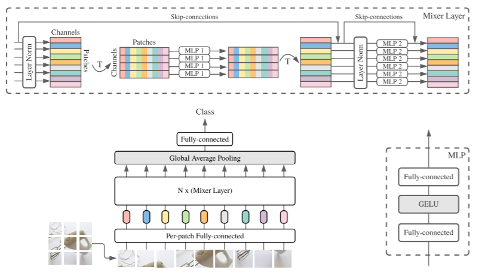
</details>
<details>
<summary>🔥 MobileNet</summary>
<p>
  
    A convolutional neural network with large number of layers is expensive, both interms of memory and the 
    hardware requirement for inference and thus deploying such models in mobile devices is not feasible.

    To overcome the above challenge, a group of researchers from Google built a neural network model 
    optimized for mobile devices referred as MobileNet. Underlying idea of mobilenet is depthwise
    seperable convolutions consisting of depthwise and a pointwise convolution to build lighter models.

    MobileNet introduces two hyperparameters

    * Width Multiplier

    Width muliplier (denoted by α) is a global hyperparameter that is used to construct smaller and less 
    computionally expensive models.Its value lies between 0 and 1.For a given layer and value of α, the 
    number of input channels 'M' becomes α * M and the number of output channels 'N' becomes α * N hence 
    reducing the cost of computation and size of the model at the cost of performance.The computation cost 
    and number of parameters decrease roughly by a factor of α2.Some commonly used values of α are 1,0.75,
    0.5,0.25.

    * Resolution Multiplier

    The second parameter introduced in MobileNets is called resolution multiplier and is denoted by ρ.This 
    hyperparameter is used to decrease the resolution of the input image and this subsequently reduces the 
    input to every layer by the same factor. For a given value of ρ the resolution of the input image becomes 
    224 * ρ. This reduces the computational cost by a factor of ρ2.

    The above parameters helps in trade-off between latency (speed of inference) and accuracy.

    MobileNet is 28 layers neural net represented by both the depthwise convolution and pointwise convolution.

     - Depthwise convolution is the channel-wise n×n spatial convolution. 
     Suppose in the figure above, we have 5 channels, then we will have 5 n×n spatial convolution.

     - Pointwise convolution actually is the 1×1 convolution to change the dimension.
</p>

</details>
<details>
  <summary>🔥 InceptionV3</summary>
  <p>
      
    The Inception deep convolutional architecture was introduced as GoogLeNet, here named Inception-v1. 
    Later the Inception architecture was refined in various ways, first by the introduction of batch 
    normalization (Inception-v2). Later by additional factorization ideas in the third iteration 
    which is referred as Inception-v3.

    Factorizing Convolution: Idea is to decrease the number of connections/parameters without reducing
    the performance.

    * Factorizing large kernel into two similar smaller kernels
        - Using 1 5x5 kernel, number of parameters is 5x5=25
        - Using 2 3x3 kernel instead of one 5x5, gives 3x3 + 3x3 = 18 parameters.
        - Number of parameter is reduced by 28%.

    * Factorizing large kernel into two assimilar smaller kernels
        - By using 3×3 filter, number of parameters = 3×3=9
        - By using 3×1 and 1×3 filters, number of parameters = 3×1+1×3=6
        - Number of parameters is reduced by 33%

    * If we look into InceptionV1 i.e. GoogLeNet, we have inception block which uses 5x5 kernel and 3x3 
    kernel, factorizing technique can reduce the number of parameters in the networks.

    Other Changes:

    From InceptionV1, we bring in Auxillary classifier which acts as regularizer. We also see, efficient
    grid size reduction using factorization instead of standard pooling which is expensive and greedy operation.
    Label smoothing, to prevent a particular label from dominating all other class.
</p>
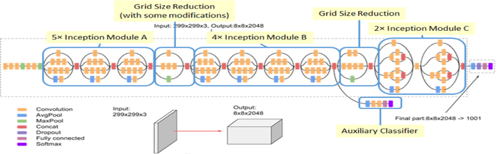
</details>
<details>
  <summary>🔥 Xception</summary>
  <p>
    
    The network uses a modified version of Depthwise Seperable Convolution. It combines
    ideas from MobileNetV1 like depthwise seperable conv and from InceptionV3, the order 
    of the layers like conv1x1 and then spatial kernels.

    In modified Depthwise Seperable Convolution network, the order of operation is changed
    by keeping Conv1x1 and then the spatial convolutional kernel. And the other difference
    is the absence of Non-Linear activation function. And with inclusion of residual 
    connections impacts the performs of Xception widely.
  </p>
  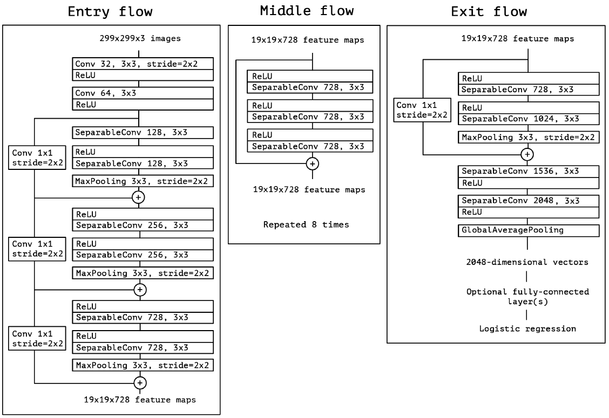
  </details>
<details>
  <summary>🔥 ResNeXt</summary>
  <p>

    ResNeXt is a simple, highly modularized network architecture for image classification. The
    network is constructed by repeating a building block that aggregates a set of transformations 
    with the same topology. The simple design results in a homogeneous, multi-branch architecture 
    that has only a few hyper-parameters to set. This strategy exposes a new dimension, which is 
    referred as “cardinality” (the size of the set of transformations), as an essential factor in 
    addition to the dimensions of depth and width.

    We can think of cardinality as the set of separate conv block representing same complexity as 
    when those blocks are combined together to make a single block.


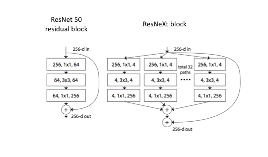
</p>   
</details>
<details>
  <summary>🔥 ViT</summary>
  <p>

    Vision Transformer aka ViT
    
    Transformers are the backbone architecture for many of the NLP architectures like BERT etc. Though, it
    started with focus on NLP tasks, the transformer is used in computer vision space. In Transformer, there
    is an encoder and a decoder block. In ViT, it uses the transformer's encoder block followed by MLP head 
    for prediction.

    We'll discuss about Transformer architecture separately except the notion on data, we'll see how the 
    image is processed in transformer, which was primarily built for sentence tokens. There are series of 
    steps followed to convert image into sequence of token and passed into transformer encoder with MLP.

    * Convert Image into Patches of fixed size.
    * Flatten those patches into sequence of embedding
    * Add positional embeddings
    * Feed the sequence into transformer encoder
    * And predict using MLP block at last.

    I've omitted few notions from transformer architecture like residual connections, multi-head attention
    etc. Each of these concept requires separate blog post.

    Note: ViT was trained on large image dataset with 14M images, and the pretrained model is fine tuned to 
    work with our custom dataset.
    
<p><strong>I strongly recommend going through code blocks, where I've mentioned the flow of an Image through
ViT architecture with all dimensional changes.<strong></p>
  
  </p>
  
  
  [Citation Details](https://github.com/lucidrains/vit-pytorch/tree/main/vit_pytorch")
</details>
<details>
  <summary>🔥 MobileNetV2</summary>
  <p>
    
    MobileNetV2

    MobileNet architecture is built with the idea to make neural networks feasible on mobile devices.
    MobileNet introduces the idea of depthwise separable convolution, which is depthwise conv followed
    by pointwise conv.

    What's New 

    With MobileNetV2, the architecture introduces the concept of inverted residual, where the residual
    connections are made between the bottleneck layers. The intermediate expansion layer uses lightweight 
    depthwise convolutions to filter features as a source of non-linearity.

    A traditional Residual Block has a wide -> narrow -> wide structure with the number of channels. The 
    input has a high number of channels, which are compressed with a 1x1 convolution. The number of 
    channels is then increased again with a 1x1 convolution so input and output can be added.

    In contrast, an Inverted Residual Block follows a narrow -> wide -> narrow approach, hence the inversion. 
    We first widen with a 1x1 convolution, then use a 3x3 depthwise convolution (which greatly reduces the 
    number of parameters), then we use a 1x1 convolution to reduce the number of channels so input and output 
    can be added. 
  </p>
  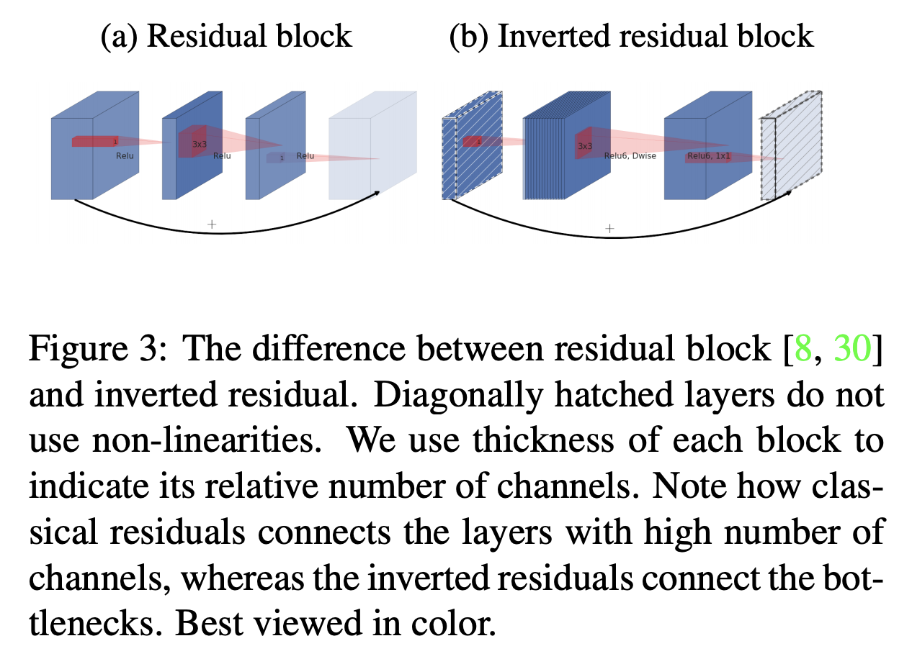
</details>
<details>
  <summary>🔥 Darknet-53</summary>
  <p>

    Darknet-53 is the backbone architecture of the YOLOV3, an Object detection model. Similar to
    Darknet-53, there is Darknet-19, which is the backbone for YOLOV2 model. Darknet has it roots
    in VGG network with most of the conv layers begin 3x3. In addition to VGGNet, Darknet-53 includes
    residual connection as in ResNet model.

  </p>
  
</details>
<details>
  <summary>🔥 SqueezeNet</summary>
  <p>

    SqueezeNet

    This network is known for providing AlexNet-Level accuracy at 50 times fewer parameters.
    This small architecture offers three major advantages, first, it requires less bandwidth
    for exporting the model and then it requires less communication between server during 
    distributed training and more feasible to deploy on FPGAs.

    Archiecture creates Fire module containing a squeeze convolution layer (which has only 
    1×1 filters), feeding into an expand layer that has a mix of 1×1 and 3×3 convolution filters.

    To reduce the parameters the architecture follows design strategies

    1. Using Conv1x1 over Conv3x3
    2. Decreasing number of channels using Squeeze Layers
    3. Downsample late in the network, such that convolution
    layers have large activation maps.

    1 and 2 helps in reducing the parameters, and 3 helps in higher classification accuracy
    because of large activation maps.

Reference: https://towardsdatascience.com/review-squeezenet-image-classification-e7414825581a

  </p>
  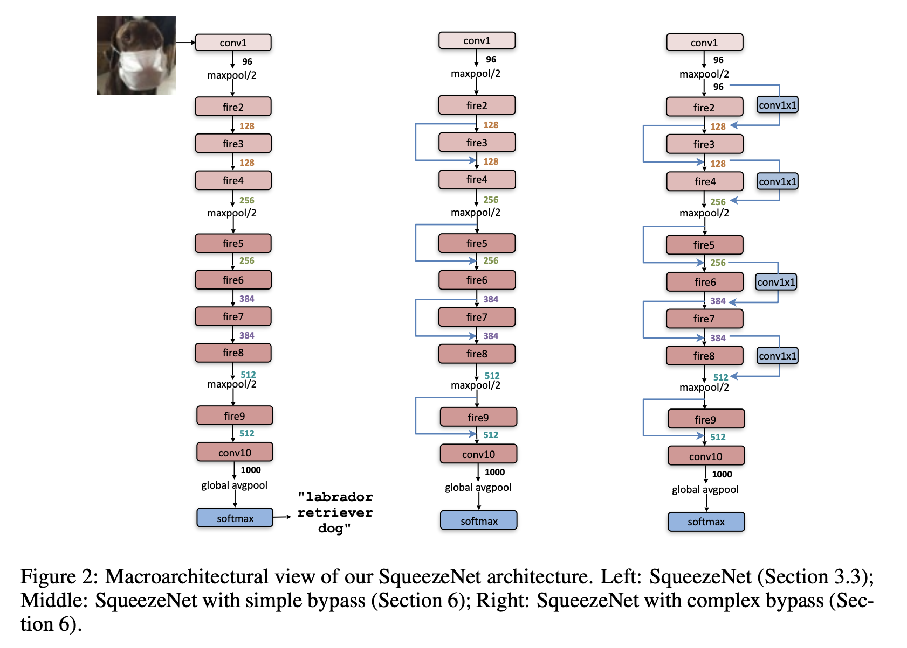
</details>
<details>
  <summary>🔥 ShuffleNet</summary>
  
  <p>

    ShuffleNet is a convolutional neural network designed specially for mobile devices 
    with very limited computing power. 

    The architecture utilizes two new operations, pointwise group convolution and channel 
    shuffle, to reduce computation cost while maintaining accuracy. ShuffleNet uses wider 
    feature maps as smaller networks has lesser number of channels.

    Channel Shuffle:

    It is an operation to help information flow across feature channels in 
    CNN.

    If we allow a group convolution to obtain input data from different groups, the input 
    and output channels will be fully related. Specifically, for the feature map generated 
    from the previous group layer, we can first divide the channels in each group into 
    several subgroups, then feed each group in the next layer with different subgroups.

    The above can be efficiently and elegantly implemented by a channel shuffle operation:

    suppose a convolutional layer with g groups whose output has (g x n) channels; we first 
    reshape the output channel dimension into (g, n), transposing and then flattening it back 
    as the input of next layer. Channel shuffle is also differentiable, which means it can be 
    embedded into network structures for end-to-end training.

    ShuffleNet achieves 13x speedup over AlexNet with comparable accuracy.
    
Reference: https://paperswithcode.com/method/channel-shuffle#
  </p>
  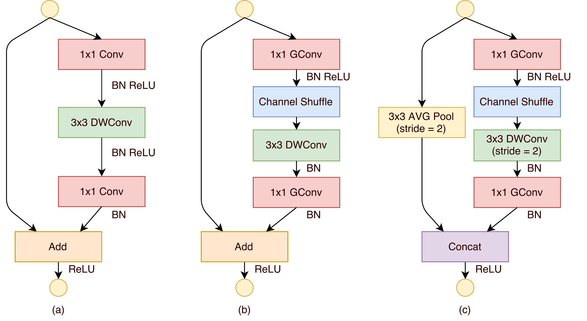
  
  
</details>
<details>
  <summary>🔥 EfficientNet</summary>
  <p>

    CNN models improves its ability to classify images by either increasing the depth of the network or 
    by increasing the resolution of the images to capture finer details of the image or by increasing
    width of the network by increasing the number of channels. For instance, ResNet-18 to ResNet-152 has 
    been built around these ideas.

    Now there is limit to each of these factors mentioned above and with increasing requirement of computational 
    power. To overcome these challenges, researchers introducted the concept of compound scaling, which scales
    all the three factors moderately leading us to build EfficientNet.

    EfficientNet scales all the three factors i.e. depth, width and resolution but how to scale it? we can 
    scale each factor equally but this wouldn't work if our task requires fine grained estimation and which 
    requries more depth. 

    Complex CNN architectures are built using multiple conv blocks and each block needs to be consistent with 
    previous and next block, thus each layers in the block are scaled evenly.

    EfficientNet-B0 Architecture

    * Basic ConvNet Block (AlexNet)
    * Inverted Residual (MobileNetV2)
    * Squeeze and Excitation Block (Squeeze and Excitation Network)

    EfficientNet is a convolutional neural network architecture and scaling method that uniformly scales all 
    dimensions of depth/width/resolution using a compound coefficient. Unlike conventional practice that arbitrary 
    scales these factors, the EfficientNet scaling method uniformly scales network width, depth, and resolution 
    with a set of fixed scaling coefficients. For example, if we want to use 2^N times more computational resources, 
    then we can simply increase the network depth by alpha^N, width by beta^N, and image size by gamma^N, where 
    alpha, beta and gamma, are constant coefficients determined by a small grid search on the original small model. 
    EfficientNet uses a compound coefficient phi to uniformly scales network width, depth, and resolution in a 
    principled way.

    The compound scaling method is justified by the intuition that if the input image is bigger, then the network 
    needs more layers to increase the receptive field and more channels to capture more fine-grained patterns on 
    the bigger image.

    The base EfficientNet-B0 network is based on the inverted bottleneck residual blocks of MobileNetV2, in addition 
    to squeeze-and-excitation blocks.

    EfficientNets also transfer well and achieve state-of-the-art accuracy on CIFAR-100 (91.7%), Flowers (98.8%), 
    and 3 other transfer learning datasets, with an order of magnitude fewer parameters.

    Interesting Stuff:

    Now, the most interesting part of EfficientNet-B0 is that the baseline architecture is designed by Neural 
    Architecture Search(NAS). NAS is a wide topic and is not feasible to be discussed here. We can simply 
    consider it as searching through the architecture space for underlying base architecture like ResNet or 
    any other architecture for that matter. And on top of that, we can use grid search for finding the scale 
    factor for Depth, Width and Resolution. Combining NAS and with compound scaling leads us to the SOTA on 
    ImageNet. Model is evaluated by comparing accuracy over the # of FLOPS(Floating point operations per second).

Recommended Reading for NAS: https://lilianweng.github.io/lil-log/2020/08/06/neural-architecture-search.html
  </p>

</details>
<details>
  <summary>🔥 ResMLP</summary>
  <p>

    ResMLP: Feedforward networks for image classification with data-efficient training 

    ResMLP, an architecture built entirely upon multi-layer perceptrons for image classification. 
    It is a simple residual network that alternates (i) a linear layer in which image patches interact, 
    independently and identically across channels, and (ii) a two-layer feed-forward network in which 
    channels interact independently per patch. When trained with a modern training strategy using heavy 
    data-augmentation and optionally distillation, it attains surprisingly good accuracy/complexity 
    trade-offs on ImageNet. 

    We can also train ResMLP models in a self-supervised setup, to further remove priors from employing a 
    labelled dataset. Finally, by adapting our model to machine translation we achieve surprisingly good results.

  </p>
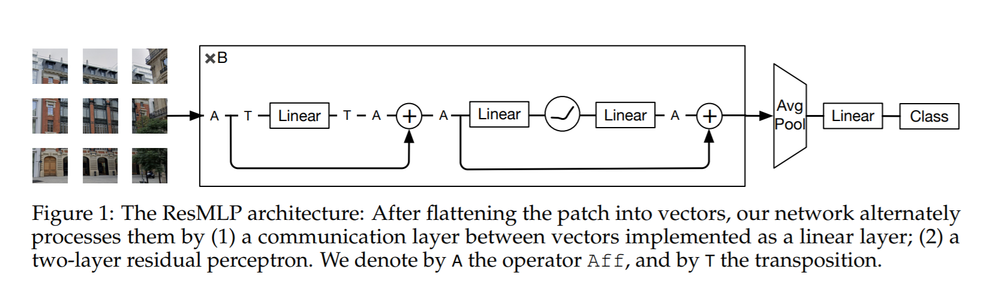
</details>

<details>
  <summary>🔥 EfficientNetV2</summary>
  <p>

    Paper: EfficientNetV2: Smaller Models and Faster Training by Mingxing Tan, Quoc V. Le

    Training efficiency has gained significant interests recently. For instance, 
    NFNets aim to improve training efficiency by removing the expensive batch normalization; 
    Several recent works focus on improving training speed by adding attention layers into 
    convolutional networks (ConvNets); Vision Transformers improves training efficiency on 
    large-scale datasets by using Transformer blocks. However, these methods often come with
    significant overheads.

    To develop these models, it uses a combination of training-aware neural search(NAS) and 
    scaling, to jointly optimize training speed and parameter efficiency.

    Drawbracks of previous version of EfficientNets

    1. training with very large image sizes is slow. 
    2. depthwise convolutions are slow in early layers.
    3. equally scaling up every stage is sub-optimal. 

    Whats New With EfficientNetV2

    Based on the above observations, V2 is designed on a search space enriched with additional 
    ops such as Fused-MBConv, and apply training-aware NAS and scaling to jointly optimize model 
    accuracy, training speed, and parameter size. EfficientNetV2, train up to 4x faster than 
    prior models, while being up to 6.8x smaller in parameter size.

    To further increase the training speed, it uses progressive increase image size, previously
    done by FixRes, Mix&Match. The only difference between the current approach from the previous 
    approach is the use of adaptive regularization as the image size is increased.

  </p>
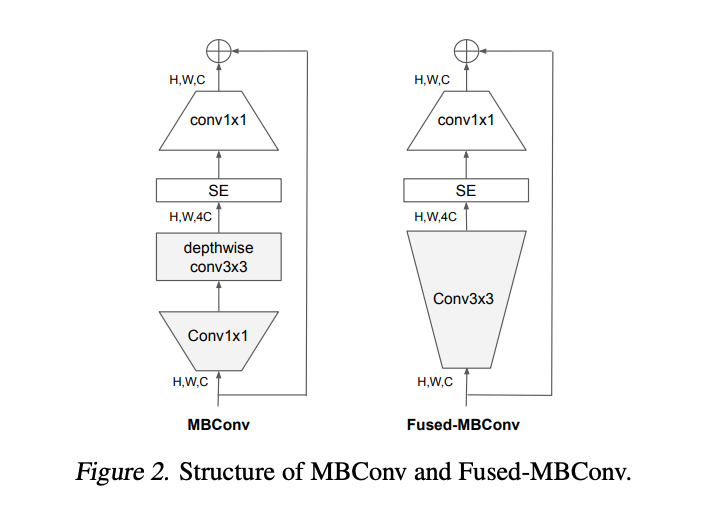
</details>

### Acknowledgement

[Phil Wang](https://github.com/lucidrains)
[Ross Wightman](https://github.com/rwightman)